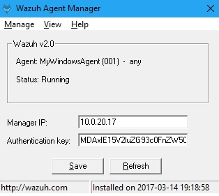

# Install agent on Windows


You will need administrator privileges to perform this installation.


## Using the GUI

To install the Windows agent from the GUI, run the downloaded file and follow the steps in the installation wizard. If you are not sure how to respond to some of the prompts, simply use the default answers.

Once installed, the agent uses a graphical user interface for configuration, opening the log file or starting and stopping the service.

 By default, all agent files will be found in: `C:\Program Files(x86)\ossec-agent`.


Now that the agent is installed, the next step is to register and configure it to communicate with the manager


