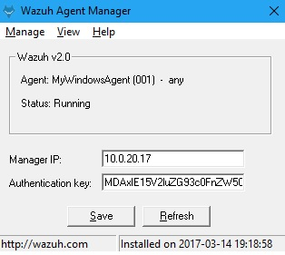

# Install agent on Windows


You will need administrator privileges to perform this installation.


## Using the GUI

To install the Windows agent from the GUI, run the downloaded file and follow the steps in the installation wizard. If you are not sure how to respond to some of the prompts, simply use the default answers.

Once installed, the agent uses a graphical user interface for configuration, opening the log file or starting and stopping the service.



 By default, all agent files will be found in: `C:\Program Files(x86)\ossec-agent`.


Now that the agent is installed, the next step is to register and configure it to communicate with the manager



## Using the command line


Unattended installations must be run with administrator permissions.


 To install the Windows agent from the command line, run the installer using the following command \(the `/q` argument is used for unattended installations\):

```text
wazuh-agent-3.7.2-1.msi /q
```

To uninstall the agent, the original MSI file will be needed to perform the unattended process:

```text
msiexec.exe /x wazuh-agent-3.7.2-1.msi /qn
```

You can automate the agent registration with authd using the following parameters:

| _Option_ | Description |
| :--- | :--- |
| APPLICATIONFOLDER | Sets the installation path. Default C:\Program Files \(x86\)\ossec-agent. |
| ADDRESS | Specifies the managers IP address or hostname. This option also accepts a list of IPs or hostnames separated by semicolons. |
| SERVER\_PORT | Specifies the managers connection port. |
| PROTOCOL | Sets the communication protocol between the manager and the agent. Accepts UDP and TCP. Default is UDP. |
| AUTHD\_SERVER | Specifies the Authd IP address. |
| AUTHD\_PORT | Specifies the Authd connection port. |
| PASSWORD | Sets the Authd password. |
| NOTIFY\_TIME | Sets the time between manager checks. |
| TIME\_RECONNECT | Sets the time in seconds until a reconnection attempt. |
| CERTIFICATE | Specifies the certificate of authority path. |
| PEM | Specifies the certificate path. |
| KEY | Specifies the key path. |
| AGENT\_NAME | Designates the agent’s name. By default will be the computer name. |
| GROUP | Assigns the specified group to the agent. |
| /l installer.log | Generates a log of the installation process. |
| /l\*v installer.log | Generates a log of the installation process, including verbose messages. |

Below there are some examples to install and register a Windows agent.

Registration with password:

```text
wazuh-agent-3.7.2-1.msi /q ADDRESS="192.168.1.1" AUTHD_SERVER="192.168.1.1" PASSWORD="TopSecret" AGENT_NAME="W2012"
```

Registration with password and assigning a group:

```text
wazuh-agent-3.7.2-1.msi /q ADDRESS="192.168.1.1" AUTHD_SERVER="192.168.1.1" PASSWORD="TopSecret" GROUP="my-group"
```

Registration with relative path to CA. It will be searched at your APPLICATIONFOLDER folder:

```text
wazuh-agent-3.7.2-1.msi /q ADDRESS="192.168.1.1" AUTHD_SERVER="192.168.1.1" AGENT_NAME="W2019" CERTIFICATE="rootCA.pem"
```

Absolute paths to CA, certificate or key that contain spaces can be written as shown below:

```text
wazuh-agent-3.7.2-1.msi /q ADDRESS="192.168.1.1" AUTHD_SERVER="192.168.1.1" KEY="C:\Progra~2\sslagent.key" PEM="C:\Progra~2\sslagent.cert"
```

The number “2” means that the file will be searched at the second occurrence of the “Progra” word, thus, the key and certificate would be searched at the folder “C:\Program Files \(x86\)”. In case this number was “1”, it would be searched at “Program Files”.


 To verify agents via SSL, it’s necessary to use both KEY and PEM options. See the verify hosts with SSL section.


Registration with protocol:

```text
wazuh-agent-3.7.2-1.msi /q ADDRESS="192.168.1.1" AUTHD_SERVER="192.168.1.1" AGENT_NAME="W2016" PROTOCOL="TCP"
```


 In Windows versions older than Windows Server 2008 or Windows 7, it’s necessary to run the `ossec-authd` program on the Wazuh manager with the `-a` flag or set the `<ssl_auto_negotiate>` option to `yes` on the auth configuration to avoid compatibility errors.



